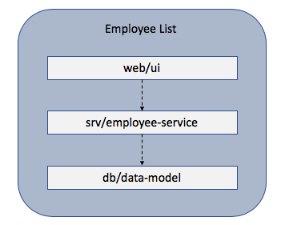

# SAP HANA INteractive Education(SHINE) for Application Programming Model for SAP Cloud Platform

## Description

This repository aims to educate on building native applications on HANA using the new [application programming model for SAP Cloud Platform](https://help.sap.com/viewer/65de2977205c403bbc107264b8eccf4b/Cloud/en-US/00823f91779d4d42aa29a498e0535cdf.html). For more general information on SHINE for XS Advanced, please refer the github repository https://github.com/SAP/hana-shine-xsa

### Business Scenario 

The business scenario is that of an admin of a fictious company trying to maintain the employees i.e. create new employee details, delete employee information and update the employee information. We call this scenario as Employee List.

### Technical details 

The application is implemented using Application Programming Model for SAP Cloud Platform. As such, we have the below mentioned application layers.

- The data model is implemented using CDS 
- The OData service is implemented using Node.js V4
- Custom Handlers are used for writing individual business logic
- The UI of the application is implemented using SAPUI5 

Below is the high level view of the components of the application. 

## Requirements
You need the paid version of on-premise installations of the below softwares
* XS Advanced Feature Revision 1 for HANA 2.0 SPS03 [release note](https://launchpad.support.sap.com/#/notes/2691905) and [patch note](https://launchpad.support.sap.com/#/notes/2709426)
* Web IDE for SAP HANA version 4.3.57 [release note](https://launchpad.support.sap.com/#/notes/2693571)

## Download and Installation

The below steps describes you to run SHINE for application programming model using 3 approaches. Choose the one that best fits you.

1. [Running in SAP Web IDE for SAP HANA](#running-in-sap-web-ide-for-sap-hana)
2. [Generating MTAR using WebIDE and deploy manually to XSA system](#generating-mtar-using-webide-and-deploy-manually-to-xsa-system)
3. [Generate MTAR using Multi-Target Application Archive Builder and deploy manually to XSA System](#generate-mtar-using-multi-target-application-archive-builder-and-deploy-manually-to-xsa-system)

### Running in SAP Web IDE for SAP HANA

1.  Launch SAP Web IDE for SAP HANA. By default, in SAP HANA, express edition, SAP Web IDE for SAP HANA can be accessed using https://hxehost:53075/
2.  Right click on the `Workspace` folder in WebIDE and choose `Git` -> `Clone Repository`
3.  Enter the URL of the repository as https://github.com/SAP/hana-shine-apm.git
4.  Click `Clone` Button. Clone should completed successfully. `Ignore` any error like `Unable to run module` for the web module.
5.   Right click on project and navigate to `Project`  ->  `Project Settings`
6.  Under Project Settings window navigate to `Space` and choose a desired space from the dropdown. Then click `Install Builder` if not installed
7.  Click `Save` and then `Close`
8.  Under project `hana-shine-apm` right click on `db` module navigate to `Build` ->  `Build` to build the module. The build should be successful.
9.  Right click on `hana-shine-apm` project navigate to `Build` ->  `Build CDS`. DIBuild should get completed without any errors.
10. Right click on `srv` module navigate to `Run` ->  `Run as Node.js Application` to run the service
11. Right click on `web` module navigate to `Run` ->  `Run as Web Application` to run web module
12. Login to SHINE web application using any user (as we have not secured the service layer but only the web layer) e.g. XSA_ADMIN user can be used to login with his credentials.

### Generating MTAR using WebIDE and deploy manually to XSA system
#### Generate MTAR using SAP Web IDE for SAP HANA
1.  Launch SAP Web IDE for SAP HANA
2.  Navigate to `File`  ->  `Git` ->  `Clone Repository`
3.  Enter the URL of the repository as https://github.com/SAP/hana-shine-apm.git
4.  Click `Clone` Button
5.  After Clone completed successfully, right click on project and navigate to `Project`  ->  `Project Settings`
6.  Under Project Settings window navigate to `Space` and choose a desired space from the dropdown. Then click `Install Builder` if not installed
7.  Click `Save` and then `Close`
8.  Right click on the project `hana-shine-apm` and navigate to `Build` ->  `Build`
9.  After build get completed successfully, under Workspace navigate to folder `mta_archives` ->  `hana-shine-apm`  and right click on `hana-shine-apm_1.0.0.mtar` then click on `Export`.
10. After `hana-shine-apm_1.0.0.mtar` get successfully exported to your local system, copy/move the file to desired XSA system

#### Deploy the MTAR
To deploy the mtar, login to the XSA system via CLI and deploy the mtar file using the following command:

  `xs deploy hana-shine-apm_1.0.0.mtar`

### Generate MTAR using Multi-Target Application Archive Builder and deploy manually to XSA System

#### Multi-Target Application Archive Builder Pre-requisites
The MTAR Builder needs Java, Git and Node.js including npm as pre-requisites. If you have one of the tools already installed you can skip the respective steps but make sure that you do not skip the npm configuration with the SAP NPM Registry.
##### Setup Java
  - Download and install the latest Java SE Development Kit (JDK) from [here](http://www.oracle.com/technetwork/java/javase/downloads/index.html)

##### Setup Git and/or GitHub Desktop
- Download and install Git from [here](https://git-scm.com/)
- And/Or download and install GitHub Desktop from [here](https://desktop.github.com/)

##### Setup Node.js and NPM
- Install Node.js from [here](https://nodejs.org/en/download/)
- Create a file with name `.npmrc` in your HOME directory. On Windows, that would be `C:/Users/<User Name>`, on macOS, that would be `~/Users/<User Name>`
- Copy the below content to the .npmrc file. With this configuration, you are instructing your npm client installation to download @sap scoped modules from the SAP NPM Registry. All other modules are still downloaded from the default registry. Update all 3 proxy settings (proxy, http-proxy, https-proxy) as per your network settings. If no proxy settings are required mark values of all 3 proxy settings as null

~~~~

registry=http://registry.npmjs.org/
@sap:registry=https://npm.sap.com/
strict-ssl=false
proxy=http://proxy:8080/
http-proxy=http://proxy:8080/
https-proxy=http://proxy:8080/

~~~~
You can read more about the SAP NPM Registry in "[SAP NPM Registry launched: Making the lives of Node.js developers easier](https://blogs.sap.com/2017/05/16/sap-npm-registry-launched-making-the-lives-of-node.js-developers-easier/)"

#### Download Multi-Target Application Archive Builder

- Go to this url https://tools.hana.ondemand.com/#cloud
- Navigate to the `Multi-Target Application Archive Builder` section
- Download the `jar`

#### Building the Source Code
- Git clone the project to a folder 
- Copy the `Multi-Target Application Archive Builder` jar to the project root directory
- From the CLI execute the following command:

  `java -jar <mta_archive_builder> --build-target=XSA build`
- An MTAR with the name `hana-shine-apm.mtar` was generated.

#### Deploy the MTAR

From the CLI, login into the XSA system and execute the below command:

`xs deploy hana-shine-apm.mtar`

## Known Issues

No known issues yet

## How to obtain support

Please use GitHub [issues](https://github.com/SAP/hana-shine-apm/issues/new) for any bugs to be reported.

## License

Copyright (c) 2018 SAP SE or an SAP affiliate company. All rights reserved.
This file is licensed under the SAP Sample Code License Agreement except as noted otherwise in the [LICENSE](LICENSES/Apache-2.0.txt) or [CREDITS](/CREDITS) file.

